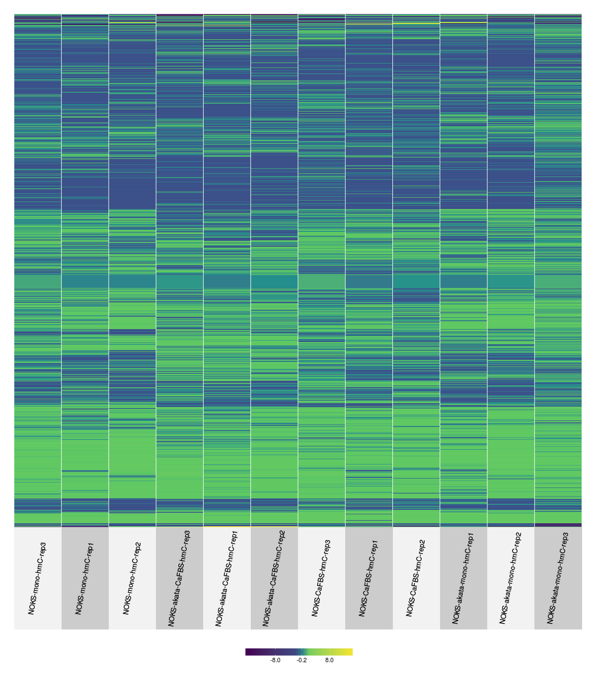

---
title: "Joint analysis MeDIP-seq / RNA-seq"
author: "Rene Welch"
date: "April 6, 2017"
output:
  revealjs::revealjs_presentation:
    theme: simple
    transition: none
    self_contained: true
--- 

```{r setup, include=FALSE,eval = TRUE}

 suppressMessages(library(tidyverse,quietly = TRUE))
 suppressMessages(library(grid,quietly = TRUE))
 suppressMessages(library(gridExtra,quietly = TRUE))
 knitr::opts_chunk$set(include = FALSE,echo = FALSE,eval = FALSE)
 
```


```{r load_rates,include=TRUE,echo=FALSE,eval = TRUE}

  suppressMessages(
  rates <- read_csv("../manuscript/hg19_MeDIP_bowtie.csv") %>% 
    mutate(mapped_perc = round(mapped_perc * 100,2)) %>% 
    rename(Total = total,Mapped = mapped,Perc = mapped_perc) %>%
    mutate(Total = prettyNum(Total,big.mark = ","),
           Mapped = prettyNum(Mapped,big.mark = ",")) %>%
    mutate(file = gsub("MeDIPseq-NOKS-","",file)) %>% rename(File = file)
  )
    rates1 = rates[1:18,]
    rates2 = rates[19:36,]

```

## MeDIP-seq aligment rates

```{r rates2,include=TRUE,echo=FALSE,eval=TRUE}

  DT::datatable(rates,options = list(pageLength = 6))

```

## A more general view 
```{r transform_data,eval = TRUE,include=FALSE}


library(ggplot2)
library(ggrepel)
library(scales)
library(ggthemes)

rates1 = rates1 %>% separate(File , into = c("akata","Treatment","Type","Repl"),sep = "-") %>% mutate(akata = NULL)
rates2 = rates2 %>% separate(File , into = c("Treatment","Type","Repl"),sep = "-")

clean_rates = bind_rows(
  rates1 %>% mutate(EBV = "NOKS_EBV"),
  rates2 %>% mutate(EBV = "NOKS") )  %>% 
  select(EBV,everything()) %>%
  mutate(Total = as.numeric(gsub(",","",Total)),
         Mapped = as.numeric(gsub(",","",Mapped)),
         Type = factor(Type , levels = c("mC","hmC","Input"))) 

```

```{r plot_total_mapped,include=TRUE,eval = TRUE,results='asis'}

  minor = 20
  major = 22
  theme_set(theme_bw())
  clean_rates %>%
    ggplot(aes(Total,Perc,colour = Type))+geom_point(shape = 0,size = 3)+
      facet_grid(EBV ~  Treatment)+
      geom_text_repel(aes(label = Repl),show.legend = FALSE)+
    theme(legend.position = "top",
          legend.text = element_text(size = minor,vjust = .5),
          legend.title = element_text(size = major),
          axis.text = element_text(size = minor),
          axis.title = element_text(size = major),
          strip.text = element_text(size = minor)
          )+
    scale_x_log10(
      breaks = c(10^5,10^6,10^7,10^8),
      labels = trans_format("log10", math_format(10^.x)))+
    scale_colour_tableau()+
    xlab("Amount of sequenced reads")+ylab("Percentage of aligned reads")+
    ylim(70,90)

```

## A bit of processing

- Removed the samples with less than 10M mapped reads

- For each cell / treatment block pooled the 3 input replicates

- For each gene in RNA-seq study, define the promoter regions as 500 bps upstream and 1K bps downstream of the TSS.

- Count the number of extended reads (by 300 bps) in each promoter region and divide by sequencing depth

- Fill matrix with $\log_2 \left( \text{sample} / \text{input}  \right)$

<!---
### MeDIP-seq heatmaps





__Top__: mC, __Bottom__: hmC  

__Left__: benCaFBS, __Middle__: benMC, __Right__: ScottMC

--->

## Differential methylation analysis

- From the heatmaps, we can observe there is not obvious differential methylation (for either treatment of cell lines)

- We have a count matrix already: For each gene we counted the number of extended reads (by 300 bps) in the associated promoter region 

- We ran DESeq2 using the count matrices and evaluated the EBV vs NOKS tests

```{r load_joint,eval = TRUE}

  load("../data/MeDIPseq_results/DESeq2_joinExpression_Methylation_MC.RData")
  load("../data/MeDIPseq_results/DESeq2_joinExpression_Methylation_HMC.RData")


  pval_histogram <- function(deseq)
  {
    plots = deseq %>% map2(names(deseq),.f = function(x,y){
      x %>% dplyr::rename(p.value = p.value.methyl) %>%
        ggplot(aes(p.value))+geom_histogram(bins = 20,boundary = 0,
                                                 fill = "white",
                                                 colour = "black")+
        ggtitle(y)+ylim(0,1300)+
        scale_y_continuous(breaks = c(0,500,1000,1250))
        
    })
    
    arrangeGrob(plots[[1]],plots[[2]],plots[[3]],plots[[4]],nrow = 2)
    
  }  
  
  
  pval_histogramlist <- function(deseq)
  {
    plots = deseq %>% map2(names(deseq),.f = function(x,y){
      x %>% dplyr::rename(p.value = p.value.methyl)
    })
    
    plots
    
  }  
  
  pp1 = mC_jointAnalysis_list %>% pval_histogram()
  pp2 = hmC_jointAnalysis_list %>% pval_histogram()

  
```

## P.value diagnostics (MC)

```{r diagnostics,eval = TRUE,include=TRUE,warning=FALSE}
  
  grid.draw(pp1)

```

## P.value diagnostics (HMC)

```{r diagnostics2,eval = TRUE,include = TRUE,warning=FALSE}

  grid.draw(pp2)

```

## Some notes

1. With the HMC samples, possibly more genes are differentially methylated. I am going to focus on those gene lists.

2. There are not a lot of differentially expressed genes, for example counting the differentially methylated genes (with MC) for the Scott MC list, we get:

```{r example,include = TRUE,eval = TRUE}

  geneListMC = mC_jointAnalysis_list[[4]] %>%
    dplyr::rename(log2FC.exp = log2FC,
                  log2FC.methyl = log2FoldChange)
  threshold = c(0.001,0.01,0.05,0.1,.3)
  tibble(threshold , 
         ngenesDiffM = threshold %>% map_dbl(.f = function(x) geneListMC  %>% 
                                               filter(padj.methyl <= x) %>% nrow),
         ngenesDiffE = threshold %>% map_dbl(.f = function(x)geneListMC %>% 
                                               filter(padj.exp <= x ) %>% nrow),
         ngenesInt = threshold %>% map_dbl(.f = function(x) geneListMC %>% 
                                             filter(padj.methyl <= x & 
                                                    padj.exp <= x) %>% nrow))

```

3. Even less of these genes are differentially expressed too.

## Same table but with hmC

```{r example2,include = TRUE,eval = TRUE}

  geneListHMC = hmC_jointAnalysis_list[[4]] %>%
    dplyr::rename(log2FC.exp = log2FC,
                  log2FC.methyl = log2FoldChange)
  threshold = c(0.001,0.01,0.05,0.1,.3)
  tibble(threshold , 
         ngenesDiffM = threshold %>% map_dbl(.f = function(x) geneListHMC %>% 
                                               filter(padj.methyl <= x) %>% nrow),
         ngenesDiffE = threshold %>% map_dbl(.f = function(x)geneListHMC %>% 
                                               filter(padj.exp <= x ) %>% nrow),
         ngenesInt = threshold %>% map_dbl(.f = function(x) geneListHMC %>% 
                                             filter(padj.methyl <= x & 
                                                    padj.exp <= x) %>% nrow))
```

- Very few genes are diff. methylated and differentially expressed considering the hMC differential methylation dataset

- The genes that are differentially expressed and differentially methylated by mC and hmC:

```{r inter,include=TRUE,eval = TRUE}

  intersect(  
    geneListMC %>% filter(padj.exp <= .1 & padj.methyl <= .1) %>% .$gene,
    geneListHMC %>% filter(padj.exp <= .1 & padj.methyl <= .1) %>% .$gene
    )

```

## Methylated and expressed genes

```{r explorPlots , include = FALSE,echo = FALSE,eval = TRUE}

  tt1 = geneListMC %>% filter(padj.exp <= 0.1 & padj.methyl <= .1)
  tt1 = tt1 %>% mutate(log2FC.exp = -log2FC.exp)
  
  tt2 =geneListHMC %>% filter(padj.exp <= 0.1 & padj.methyl <= .1)
  tt2 = tt2 %>% mutate(log2FC.exp = -log2FC.exp)

  tt = bind_rows(tt1  %>% mutate(methtr = "mC"),
                 tt2 %>% mutate(methtr = "hmC"))
  
  theme_set(theme_bw())
  
  base = tt %>% ggplot(aes(x = log2FC.exp,y = log2FC.methyl)) + geom_point(size = 2,shape = 1) +
    xlab("log2FC expression")+
    ylab("log2FC methylation")+
    geom_abline(slope = 0 , intercept = 0 , linetype = 2 ,colour = "red") +
    geom_vline(xintercept = 0,linetype = 2 ,colour = "red")+
    facet_grid( ~ methtr)

  withlabels = base +geom_text_repel(aes(label = gene),show.legend = FALSE)

  val = .2
  
  region1 = tibble(xmin = -Inf, xmax = -val, ymin = val, ymax = Inf)
  region2 = tibble(xmin = val , xmax = Inf , ymin = val, ymax = Inf)
  region3 = tibble(xmin = val, xmax = Inf, ymin = -Inf, ymax = -val)
  region4 = tibble(xmin = -Inf, xmax = -val, ymin = -Inf , ymax = -val)
  
  focus = withlabels + 
   geom_rect(data = region1,aes(xmin = xmin,xmax = xmax,ymin = ymin,ymax = ymax),
             fill="lightgreen",
             inherit.aes = FALSE,alpha = .5)+
    geom_rect(data = region3,aes(xmin = xmin,xmax = xmax,ymin = ymin, ymax = ymax),
              fill = "lightgreen",
              inherit.aes = FALSE,alpha = .5)
  
  focus2 = withlabels + 
   geom_rect(data = region2,aes(xmin = xmin,xmax = xmax,ymin = ymin,ymax = ymax),
             fill="red",
             inherit.aes = FALSE,alpha = .3)+
    geom_rect(data = region4,aes(xmin = xmin,xmax = xmax,ymin = ymin, ymax = ymax),
              fill = "red",
              inherit.aes = FALSE,alpha = .3)

```


```{r img1, include = TRUE,eval = TRUE,warning = FALSE,fig.height=5,fig.width = 10}

  focus + xlim(-4,3)

```

