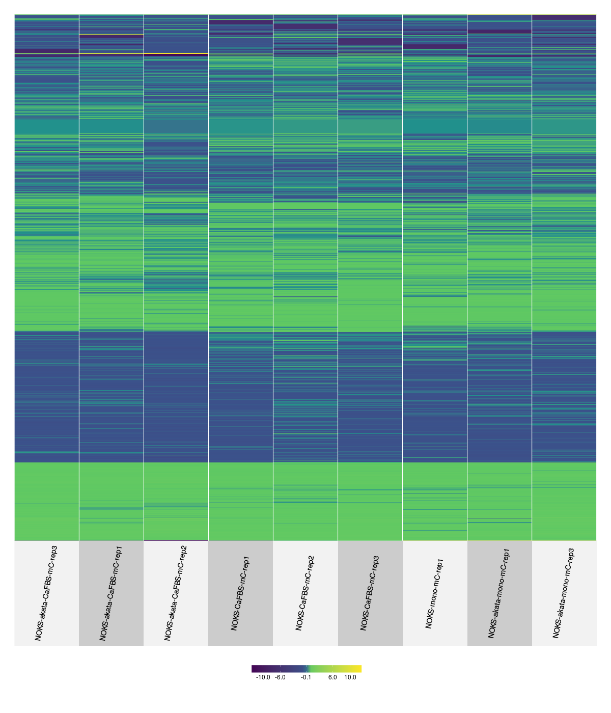
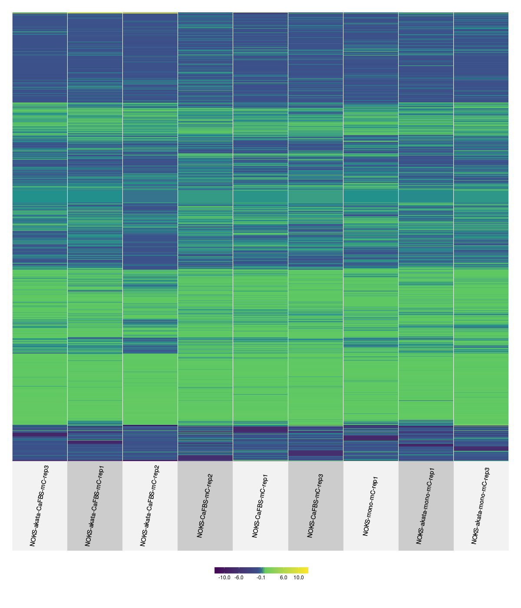
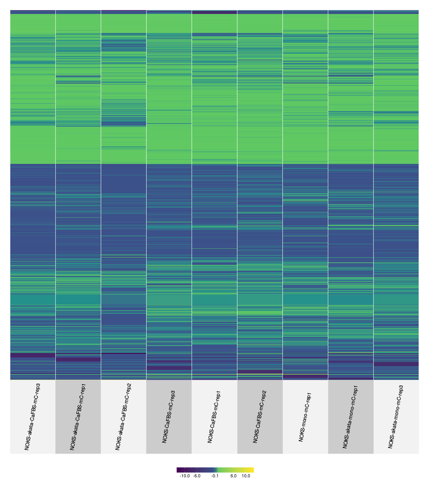
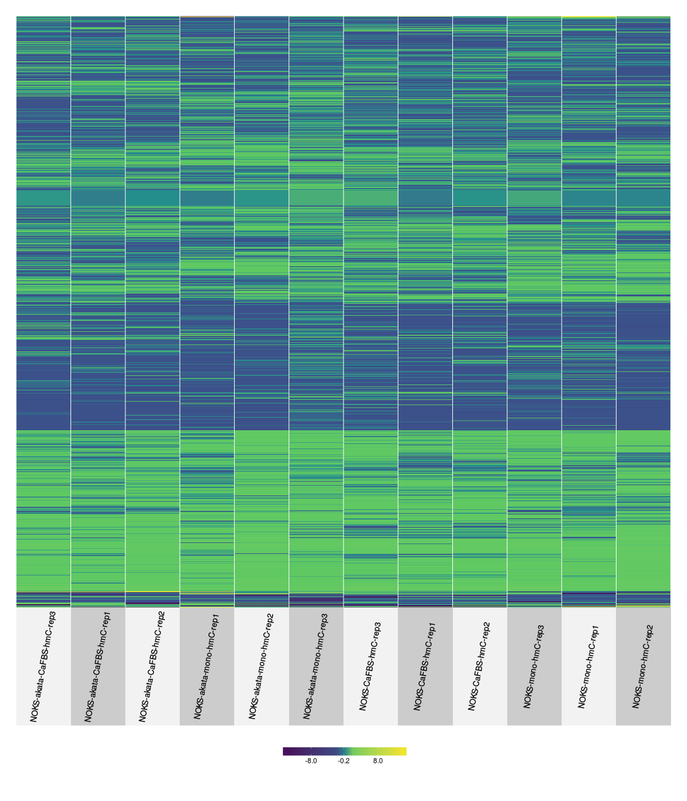
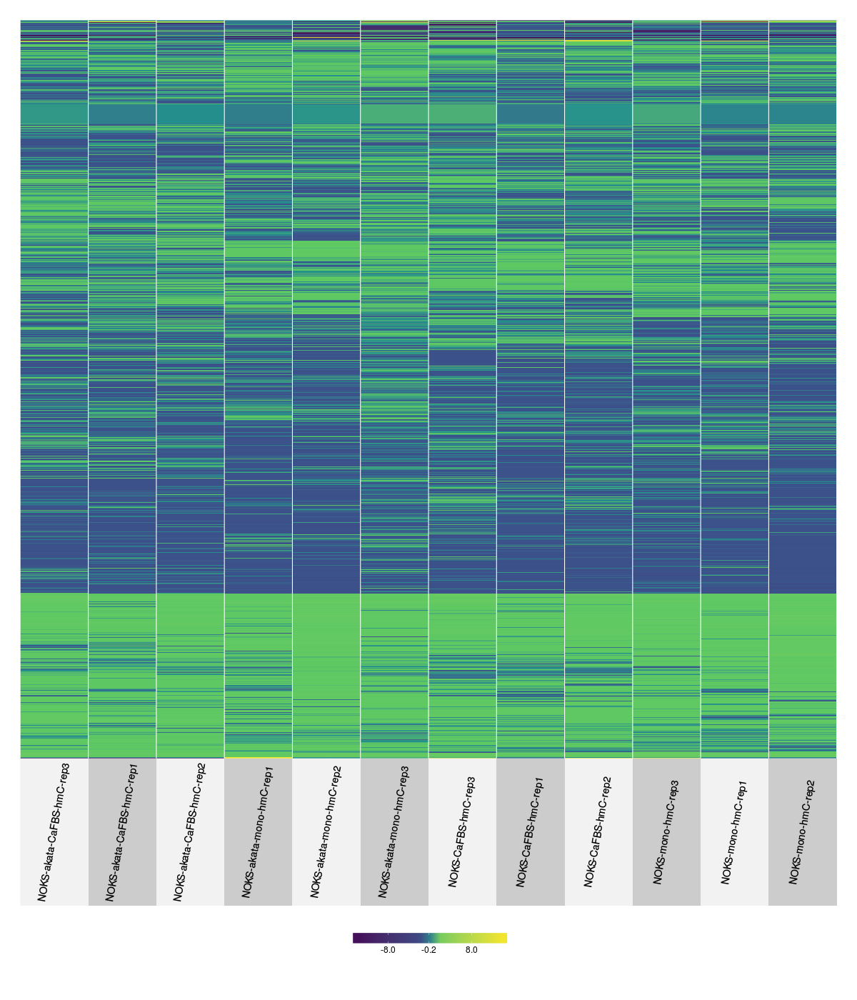

## MeDIP-seq aligment rates


```
## PhantomJS not found. You can install it with webshot::install_phantomjs(). If it is installed, please make sure the phantomjs executable can be found via the PATH variable.
```

```
## Warning in normalizePath(f2): path[1]="./webshot3e6629c78eb7.png": No such
## file or directory
```

```
## Warning in file(con, "rb"): cannot open file './webshot3e6629c78eb7.png':
## No such file or directory
```

```
## Error in file(con, "rb"): cannot open the connection
```

--- ds:noborder

## A more general view 


## A bit of processing

- Removed the samples with less than 10M mapped reads

- For each cell / treatment block pooled the 3 input replicates

- For each gene in RNA-seq study, define the promoter regions as 500 bps upstream and 1K bps downstream of the TSS.

- Count the number of extended reads (by 300 bps) in each promoter region and divide by sequencing depth

- Fill matrix with $\log_2 \left( \text{sample} / \text{input}  \right)$

---

### MeDIP-seq heatmaps









__Top__: mC, __Bottom__: hmC  

__Left__: benCaFBS, __Middle__: benMC, __Right__: ScottMC

## Differential methylation analysis

- From the heatmaps, we can observe there is not obvious differential methylation (for either treatment of cell lines)

- We have a count matrix already: For each gene we counted the number of extended reads (by 300 bps) in the associated promoter region 

- We ran DESeq2 using the count matrices and evaluated the EBV vs NOKS tests


